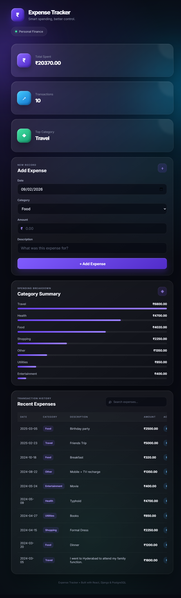

# Expense Tracker Management System

A full-stack expense management application built with **React.js** and **Django REST Framework**. It lets users record, search, update, delete, and analyze expenses through a responsive browser interface.

## Live Demo

- **Frontend:** https://expense-tracker-management-system-2-1.onrender.com
- **Backend API:** https://expense-tracker-management-system-2.onrender.com/api/expenses/

## Application Preview



## Features

- Add, view, edit, and delete expenses
- Search expenses by description or category
- Filter expenses by category through the API
- Automatic total spending and transaction count
- Category-wise spending summary
- RESTful CRUD API with Django REST Framework
- Django Admin support
- SQLite for local development
- PostgreSQL support for production
- Environment-based production configuration
- Responsive React UI

## Architecture

```text
React + Vite Frontend
        ↓ REST API
Django + Django REST Framework
        ↓ Django ORM
SQLite (local) / PostgreSQL (production)
```

## Tech Stack

**Frontend:** React.js, Vite, JavaScript, HTML5, CSS3  
**Backend:** Python, Django, Django REST Framework  
**Database:** PostgreSQL, SQLite  
**Tools:** Git, GitHub, REST API, JSON

## Project Structure

```text
Expense-Tracker-Management-System/
├── backend/
│   ├── expense_tracker/
│   ├── expenses/
│   ├── manage.py
│   ├── requirements.txt
│   ├── build.sh
│   └── .env.example
├── frontend/
│   ├── src/
│   ├── index.html
│   ├── package.json
│   ├── vite.config.js
│   └── .env.example
├── .gitignore
└── README.md
```

## Run Locally

### Backend

```bash
cd backend
python -m venv venv
```

Windows:

```bash
venv\Scripts\activate
```

Install dependencies and initialize the database:

```bash
pip install -r requirements.txt
python manage.py migrate
python manage.py runserver
```

Backend API:

```text
http://127.0.0.1:8000/api/
```

### Frontend

Open a second terminal:

```bash
cd frontend
npm install
npm run dev
```

The Vite development server normally runs at:

```text
http://localhost:5173
```

For local development, the frontend defaults to `http://127.0.0.1:8000/api`. For deployment, set `VITE_API_URL` to the deployed backend API URL.

## API Endpoints

| Method | Endpoint | Purpose |
|---|---|---|
| GET | `/api/expenses/` | List expenses |
| POST | `/api/expenses/` | Create an expense |
| GET | `/api/expenses/<id>/` | Retrieve an expense |
| PUT | `/api/expenses/<id>/` | Update an expense |
| DELETE | `/api/expenses/<id>/` | Delete an expense |
| GET | `/api/summary/` | Spending summary |

## Production Configuration

The backend supports PostgreSQL through `DATABASE_URL` and uses environment variables for the Django secret key, debug mode, allowed hosts, and CORS origins. Static files are configured with WhiteNoise and the project can be served with Gunicorn.

Before deployment, configure:

```text
DJANGO_SECRET_KEY
DJANGO_DEBUG=False
DJANGO_ALLOWED_HOSTS
CORS_ALLOWED_ORIGINS
DATABASE_URL
```

The frontend deployment should set:

```text
VITE_API_URL=https://expense-tracker-management-system-2.onrender.com/api
```

## Resume Highlights

- Built a full-stack expense management application using **Python, Django REST Framework, React.js, and PostgreSQL/SQLite**.
- Developed RESTful CRUD APIs and integrated them with a responsive React frontend.
- Implemented expense search, category filtering, spending summaries, and persistent database storage.
- Configured the application for production deployment using environment variables, PostgreSQL, Gunicorn, and WhiteNoise.

## Author

Vinod Kumar
